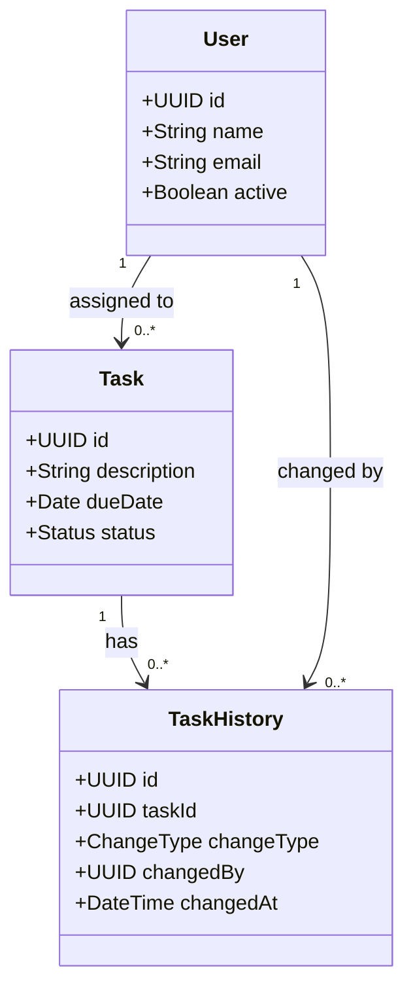

# Entity Model

### User
A registered person who can create and be assigned tasks.

| Attribute | Type | Length | Validation |
|---|---|---|---|
| id | UUID | 36 | Required, unique, immutable |
| name | String | 100 | Required, not empty |
| email | String | 255 | Required, unique, valid email format |
| active | Boolean | – | Required, default true |

### Task
A unit of work with a description, due date, and status.

| Attribute | Type | Length | Validation |
|---|---|---|---|
| id | UUID | 36 | Required, unique, immutable |
| description | String | 500 | Required, not empty |
| dueDate | Date | – | Optional, must be today or in the future |
| status | Enum | – | Required, allowed values: OPEN, ASSIGNED, DONE, DELETED |

### TaskHistory
An immutable log entry recording a single change made to a task.

| Attribute | Type | Length | Validation |
|---|---|---|---|
| id | UUID | 36 | Required, unique, immutable |
| taskId | UUID | 36 | Required, must reference an existing Task |
| changeType | Enum | – | Required, allowed values: CREATED, UPDATED, ASSIGNED, DELETED |
| changedBy | UUID | 36 | Required, must reference an existing User |
| changedAt | DateTime | – | Required, set by the system at creation time |
